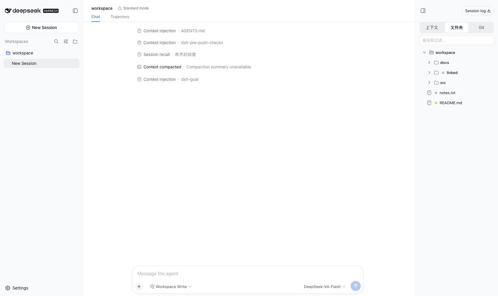
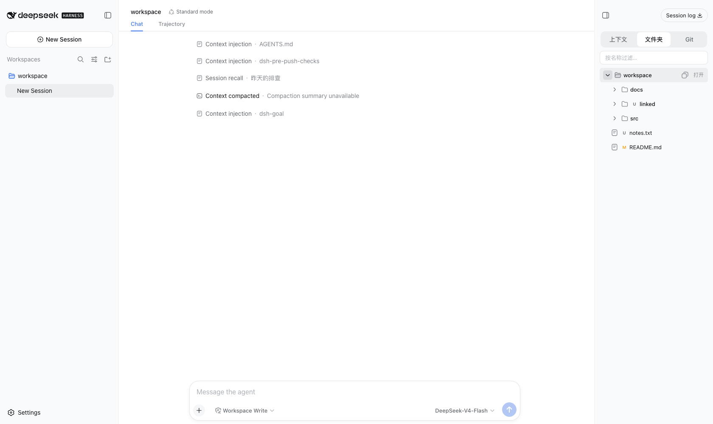

# dsh-compass

English | [中文](README.zh.md)

A single-package [DeepSeek Harness](https://github.com/deepseek-ai/deepseek-harness) plugin adding a right-side context-and-files panel to the Web GUI: directory browsing with git status badges, live injected-context documents with a compaction history stream, a framed read-only git commit graph with working-tree status, panel-file drag into the conversation (image intake for vision models), and a session-log download action.

The package is one bundle, one loader row: the host half mounts the local git backend (`/git/*`), the plugin-owned directory routes (`/dir/*`), and the `/export` command as child plugins; the browser half registers the panel into `shell.overlay` and the download action into the panel's header utilities.

## Screenshots

**Files tab** — lazy directory tree with directories-first order, basename filter, git working-tree status badges, and per-row open/copy actions:



**Git tab** — framed working-tree block and commit tree: branch position, uncommitted files, lanes, ref badges, lazy commit expansion, and a refresh control. Workspace rows and commit files open their diff in the centered pop-out, colored by line role:


**Context tab** — injected-context documents split into the live window and the compaction history stream, with search over both; the view re-projects live and auto-walks the session history on activation (up to 1,000 messages), so both sections hold the complete log:


**Directories first** — symlinked directories sort with the directories group:



**Panel-file drag** — file rows drag their absolute path into the conversation; image files attach their content directly on vision models, other models receive the path sentence:


## Main-track compatibility

The package carries every capability surface it needs, so it installs on any dsh build whose web composition includes the slot system (in upstream `master` since the slot-system commit; the last npm release predates it):

- directory listing and text reads go through the package's own bounded browser (`/dir/*` reads the filesystem directly — no `directoryPicker.readText`, no browse backend requirement, works even when the profile composes a native chooser);
- the git seam and its local backend ship inside the package (`ctx.subprocess` + `ctx.webServer` come from the base composition);
- the conversation reserve uses the package's own `--dsh-compass-width` variable and a CSS `:has()` rule against the shell's stable `[data-shell-overlay]` hook — no fork CSS required (the fork's in-box rule reads a different variable, so no composition double-pads).

## Install

Install from this repository with a pinned commit:

```sh
dsh plugin --profile web add github:Happy2Git/dsh-compass#<commit-sha>
```

Git installs build from source through the package's `prepare` script (transpile-only, no dev context). pnpm ≥10 blocks the build until allowed; on the first failed `add`, copy the exact key pnpm printed into the profile's `pnpm-workspace.yaml`:

```yaml
allowBuilds:
  dsh-compass: true
```

and re-run the `add`. That allowance is permission to execute this package's code at install time — pin a commit so a later push cannot silently change what runs.

The fork's default `web` profile ships the same panel in-box. To use this package instead, disable the in-box rows in the profile's own `cordis.patch.yml`:

```yaml
- id: ui-context-files
  disabled: true
- id: git
  disabled: true
- id: directory-routes
  disabled: true
- id: session-log-download
  disabled: true
```

Local checkouts install without any build permission:

```sh
dsh plugin --profile web add ./dsh-compass
```

## Building

`pnpm build` (also the `prepare` script) runs tsdown only — the shipped entry points transpile from `src/` with no type checking, so a git install builds self-contained. Type safety is owned where the sources originate: these sources are typechecked under the fork's strict aggregate before extraction, and the bundled `tsconfig.json` maps the `@deepseek-ai/dsh-*` types to a sibling `../deepseek-harness` checkout for editor support.

## Roadmap

The package is published and installable; here is where it goes next. Star or watch the repo to follow along.

- **English UI locale.** The panel copy is Chinese today; add an English dictionary behind the locale service.
- **Exact-path git output.** The git backend parses `--name-status`/`--numstat` with default quoting; switch to `-z` NUL-terminated output so paths with quotes or tabs display exactly.
- **Rename-aware file list.** Show a rename as one row instead of a delete + add pair.
- **Main-track install.** Once an upstream release ships the slot system in its web composition, the package installs onto the published dsh directly (today it needs a slot-system build or the fork).
- **dsh-terminal.** The terminal TUI is packaged the same way and stays local until its feature set grows.

## License

MIT. Copyright (c) 2026 DeepSeek.
